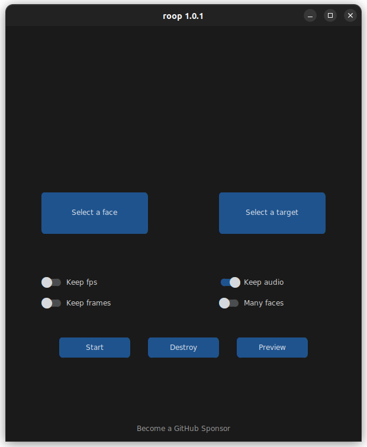

## RU:
Эта версия является форком [roop-cam](https://github.com/hacksider/roop-cam) я же в свою очередь перевел, добавил ряд твиков, упростил процедуру установки и запуска и сделал портативную версию для запуска в 1 клик на CPU, а также на видеокартах Nvidia и AMD

Если у вас проблемы с установкой, то можете попробовать загрузить портативную сборку.

Скачать портативную сборку можно тут:

[Яндекс Диск](https://disk.yandex.ru/d/7IUx0jAubqK7xQ)

[Моё облако](https://dl.neurochat-gpt.ru/index.php/s/x9q5CM7wNDEdzme)

[Мой телеграм канал](https://t.me/neurogen_news)

## Инструкция для Nvidia:

Требования к системе:
1) Установленный Python 3.10 ( https://www.python.org/ftp/python/3.10.11/python-3.10.11-amd64.exe )
2) Установленный Git ( https://github.com/git-for-windows/git/releases/download/v2.41.0.windows.1/Git-2.41.0-64-bit.exe )
3) Установленная Visual Studio (https://visualstudio.microsoft.com/ru/vs/community/)
4) Установленный CUDA Toolkit 11.8 (https://developer.nvidia.com/cuda-11-8-0-download-archive)
5) Установленные CUDNN
6) Установленный ffmpeg (https://github.com/BtbN/FFmpeg-Builds/releases)

Подготовка с нуля (если вы раньше не работали с нейронками):
Выполните пункты с 1 по 4
https://pikabu.ru/story/prodolzhenie_posta_polzovatel_sozdal_skript_kotoryiy_pozvolyaet_sozdavat_deepfake_v_odin_klik_kachestvo_kak_po_mne_otlichnoe_i_prevoskhodit_predyidushchie_resheniya_10282774
Затем следующие шаги:

- Установите Cuda Toolkit 11.8: https://developer.nvidia.com/cuda-11-8-0-download-archive
- Скачайте CUDNN: https://developer.nvidia.com/downloads/compute/cudnn/secure/8.9.1/local_installers/11.8/cudnn-windows-x86_64-8.9.1.23_cuda11-archive.zip/
После чего распакуйте архив, откройте папку bin и скопируйте файлы в папку C:\Program Files\NVIDIA GPU Computing Toolkit\CUDA\v11.8\bin

- Скачайте архив с [roop](https://github.com/Em1tSan/roop-neurogen/archive/refs/heads/roop-cam.zip) и распакйте его

Запуск:

- Внесите под себя правки в файле start_nvidia.bat и запустите его. 

## Инструкция для AMD и Intel:

Требования к системе:
1) Установленный Python 3.10 ( https://www.python.org/ftp/python/3.10.11/python-3.10.11-amd64.exe )
2) Установленный Git ( https://github.com/git-for-windows/git/releases/download/v2.41.0.windows.1/Git-2.41.0-64-bit.exe )
3) Установленная Visual Studio (https://visualstudio.microsoft.com/ru/vs/community/)
4) Установленный ffmpeg (https://github.com/BtbN/FFmpeg-Builds/releases)

Подготовка с нуля (если вы раньше не работали с нейронками):
Выполните пункты с 1 по 4
https://pikabu.ru/story/prodolzhenie_posta_polzovatel_sozdal_skript_kotoryiy_pozvolyaet_sozdavat_deepfake_v_odin_klik_kachestvo_kak_po_mne_otlichnoe_i_prevoskhodit_predyidushchie_resheniya_10282774

Скачайте архив с [roop](https://github.com/Em1tSan/roop-neurogen/archive/refs/heads/roop-cam.zip) и распакйте его

Запуск:

- Внесите под себя правки в файле start_amd.bat и запустите его. 

## EN:

Take a video and replace the face in it with a face of your choice. You only need one image of the desired face. No dataset, no training.

You can watch some demos [here](https://drive.google.com/drive/folders/1KHv8n_rd3Lcr2v7jBq1yPSTWM554Gq8e?usp=sharing). A StableDiffusion extension is also available, [here](https://github.com/s0md3v/sd-webui-roop).


## Disclaimer
This software is meant to be a productive contribution to the rapidly growing AI-generated media industry. It will help artists with tasks such as animating a custom character or using the character as a model for clothing etc.

The developers of this software are aware of its possible unethical applicaitons and are committed to take preventative measures against them. It has a built-in check which prevents the program from working on inappropriate media including but not limited to nudity, graphic content, sensitive material such as war footage etc. We will continue to develop this project in the positive direction while adhering to law and ethics. This project may be shut down or include watermarks on the output if requested by law.

Users of this software are expected to use this software responsibly while abiding the local law. If face of a real person is being used, users are suggested to get consent from the concerned person and clearly mention that it is a deepfake when posting content online. Developers of this software will not be responsible for actions of end-users.

## How do I install it?

**Issues regarding installation will be closed from now on, we cannot handle the amount of requests.**

- **Basic:** It is more likely to work on your computer but it will also be very slow. You can follow instructions for the basic install [here](https://github.com/s0md3v/roop/wiki/1.-Installation).

- **Acceleration:** If you have a good GPU and are ready for solving any software issues you may face, you can enable GPU which is wayyy faster. To do this, first follow the basic install instructions given above and then follow GPU-specific instructions [here](https://github.com/s0md3v/roop/wiki/2.-Acceleration).

## How do I use it?
> Note: When you run this program for the first time, it will download some models ~300MB in size.

Executing `python run.py` command will launch this window:


Choose a face (image with desired face) and the target image/video (image/video in which you want to replace the face) and click on `Start`. Open file explorer and navigate to the directory you select your output to be in. You will find a directory named `<video_title>` where you can see the frames being swapped in realtime. Once the processing is done, it will create the output file. That's it.

Additional command line arguments are given below. To learn out what they do, check [this guide](https://github.com/s0md3v/roop/wiki/Advanced-Options).

```
options:
  -h, --help            show this help message and exit
  -s SOURCE_PATH, --source SOURCE_PATH
                        select an source image
  -t TARGET_PATH, --target TARGET_PATH
                        select an target image or video
  -o OUTPUT_PATH, --output OUTPUT_PATH
                        select output file or directory
  --frame-processor {face_swapper,face_enhancer} [{face_swapper,face_enhancer} ...]
                        pipeline of frame processors
  --keep-fps            keep original fps
  --keep-audio          keep original audio
  --keep-frames         keep temporary frames
  --many-faces          process every face
  --video-encoder {libx264,libx265,libvpx-vp9}
                        adjust output video encoder
  --video-quality VIDEO_QUALITY
                        adjust output video quality
  --max-memory MAX_MEMORY
                        maximum amount of RAM in GB
  --execution-provider {cpu,...} [{cpu,...} ...]
                        execution provider
  --execution-threads EXECUTION_THREADS
                        number of execution threads
  -v, --version         show program's version number and exit
```

Looking for a CLI mode? Using the -s/--source argument will make the run program in cli mode.

## Credits
- [henryruhs](https://github.com/henryruhs): for being an irreplaceable contributor to the project
- [ffmpeg](https://ffmpeg.org/): for making video related operations easy
- [deepinsight](https://github.com/deepinsight): for their [insightface](https://github.com/deepinsight/insightface) project which provided a well-made library and models.
- and all developers behind libraries used in this project.
